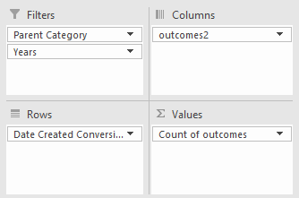
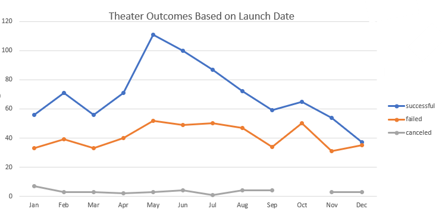
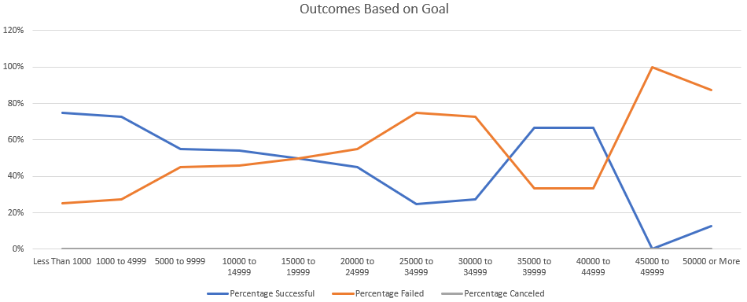

# Kickstarting with Excel

## Overview of Project

Here, we are analyzing the success rate of theater-based Kickstarter projects in relation to the launch date. In addition, we'll compare the success rate of Kickstarters for plays to their funding goals.

### Purpose

Our purpose is to determine if there is an optimal time to launch Kickstarters within theater, as well as seeing if there is a correlation between their success and the amount requested.

## Analysis and Challenges

### Analysis of Outcomes Based on Launch Date

-In order to get this data, I first created a column in my data set to isolate the year within each start date, using this formula: <=YEAR(T2)> where T is a column of Creation Dates for fundraising projects
-After This, I created a duplicate column for "outcomes" so I could place this data in both my columns and values within a pivot table.
-Next, I created my pivot table. I set it up like 
	
-From here, it was a matter of creating a line graph, where the x-axis represented months, while the y-axis shows the total sum of any given outcome (success, failure, cancellation,).
	

### Analysis of Outcomes Based on Goals

-To find this information, I first needed to create the parameters for the data. Starting with anything under $1,000, then $1,000.00 to $4,999.00, and so-on counting in increments of 5,000
-Next, I generated the number of successful, failed, and canceled projects in rows B, C, and D respectively.
-To find the sums, I used COUNTIFS formulas in each corresponding column, making sure to include the subcategory of "Plays" in our Kickstarter data being a part of the criteria
	-For Successful projects: <=COUNTIFS(Kickstarter!$F:$F,"successful",Kickstarter!$D:$D,"<=1000",Kickstarter!$S:$S,"plays")>
	-Failed: <=COUNTIFS(Kickstarter!$F:$F,"failed",Kickstarter!$D:$D,"<=1000",Kickstarter!$S:$S,"plays")>
	-Canceled: <=COUNTIFS(Kickstarter!$F:$F,"canceled",Kickstarter!$D:$D,"<=1000",Kickstarter!$S:$S,"plays")>
	**These formulas were adjusted to include numbers within the ranges in each column (eg, <=COUNTIFS(Kickstarter!$F:$F,"successful",Kickstarter!$D:$D,">=1000",Kickstarter!$D:$D,"<=4999",Kickstarter!$S:$S,"plays")> for successful projects, and so on.)

-Next, using the formula <=SUM(B2:D2)>, I calculated the total number of projects per funding goal level
-Now that I have this info, I created columns for the percentage of orders that were successful, failed, and canceled
	-To determine the percentages, I used the following formulas:
		-Successful: <=ROUND(B2/$E2,3)>
		-Failed: <=ROUND(C2/$E2,3)>
		-Canceled: <=ROUND(D2/$E2,3)>
-From here, I created 

### Challenges and Difficulties Encountered

-On my "Outcomes Based on Launch Goals" portion, I had difficulty with getting my pivot table to display outcomes in both the columns and values sections. As a solution, I simply made a second "Outcomes" column in my data set.

## Results

- What are two conclusions you can draw about the Outcomes based on Launch Date?
	-We can see that Theater Kickstarters that launch in the summer months, especially May, have a higher overall success rate than the remainder of the year.
	-We can also see that a higher number of failed kickstarters happened during those same months. The success-to-failure rate also remains pretty steady throughout the year, suggesting that the time of year doesn't have much bearing on your success rate.

- What can you conclude about the Outcomes based on Goals?
	-In general, we can see that the success rate of Plays on Kickstarter had an inverse correlation to their funding goals. That is: the higher the goal, the lower the success rate.
	-While there is a spike in the percentage of successful projects in the $35000 to $45000 dollar ranges, there is not enough information here to suggest that these projects fall outside of the trends in the dataset.

- What are some limitations of this dataset?
	-This data does not give us enough info with regard to location. While we can take a look at the country of origin, we can't drill into what kind of community these projects are taking place in. For instance, a funding project for a play in a large city like New York will perform differently than a project in rural Iowa. With more datapoints, we would be able to steer the client toward the appropriate time window and funding goal.
	-Another shortcoming is that there is no accounting for genre within the data. As the arts can vary in support based on subject matter, it seems like a missed opportunity to see whether there are trends related to whether one genre may outperform others. This could also help us to see what time of year is best to produce which genre.

- What are some other possible tables and/or graphs that we could create?
	-One possible table we could create would be comparing the average amount of backers across the same metrics. This could help us answer several questions: is there a correlation between overall success and the volume of backers? Do higher-dollar goals require more backers to be successful?
	-It would also be interesting to see whether the length of the fundraiser had any impact on it's success rate.
		-To produce this, we could use the same outline from our Outcomes Based on Goals sheet, and label the "Goal" column as "Length (in mo.)", then number the columns from 1-12
		-We will need to create a new column in the main data set to count the length days each project lasted for. We can use this formula: =DATEDIF(T2,U2,"d"), and drag it down through the column
		-In our spreadsheet, we could recreate the data, replacing the increments in our COUNTIFS so that they are counted in increments of 30. The Totals & Percentage formulas wouldn't have to change, and then we could see if there was any material information to show.
